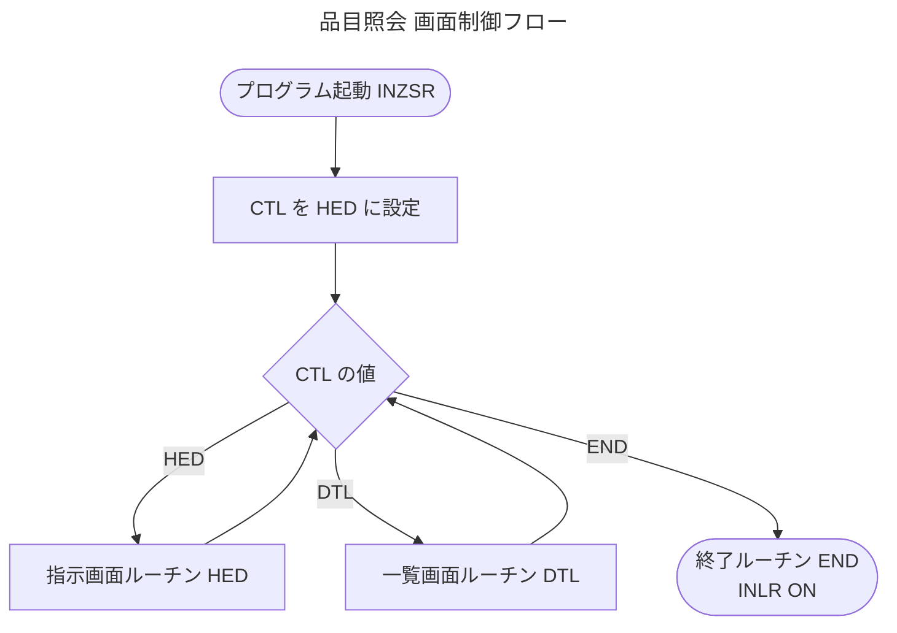
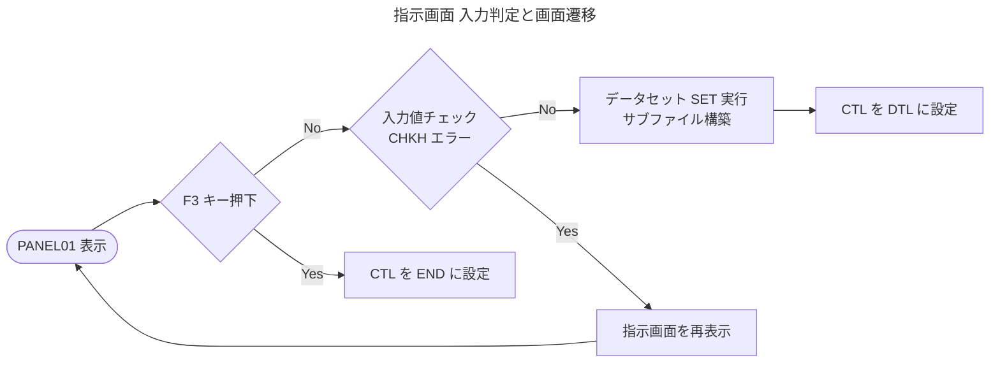
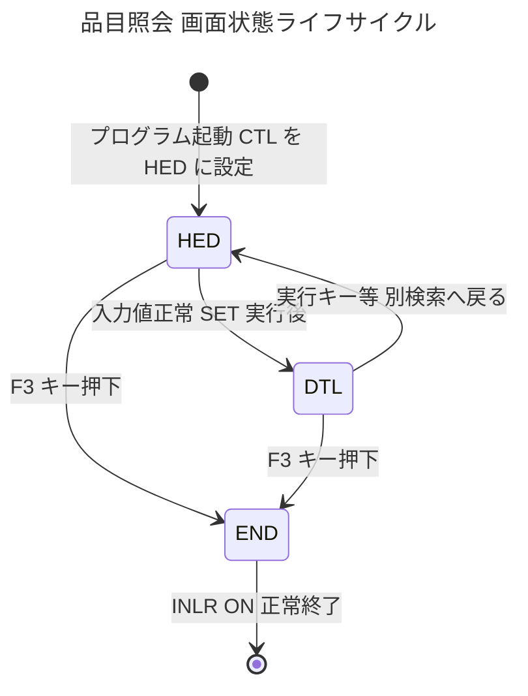

# IPL020 品目照会プログラム ビジネスルール報告書

---


# 1. エグゼクティブサマリー

**プログラム名：** IPL020 — 品目照会プログラム

本プログラムは、社内在庫管理システムにおける**品目（商品・資材）情報の検索・一覧表示**を担う業務機能です。ユーザーは品名カナ（読み仮名）をキーワードとして入力し、品目マスターから該当する品目を絞り込んで一覧で確認することができます。

業務的な役割としては、倉庫担当者・購買担当者・管理部門が日常的に品目情報を参照する際の**標準的な照会インターフェース**として機能します。検索条件の入力、結果一覧の閲覧、別条件での再検索という一連の操作を、シンプルな3段階の画面フローで実現しています。

**主要業務機能：**

- 品名カナによる品目マスター検索
- 検索条件に一致する品目の一覧表示（サブファイル）
- 別条件での再検索（指示画面への戻り）
- F3キーによる安全な終了操作

本プログラムは単独の照会ツールとして位置づけられており、データの登録・更新・削除は行いません。品目マスター（`HINMSL01`）への読み取りアクセスのみを行う**参照専用プログラム**です。

---


# 2. 詳細ビジネスルール


## 🔄 ワークフロー・ルール（画面制御）


### プログラム起動時の初期画面制御

| 項目 | 内容 |
|------|------|
| **カテゴリ** | ワークフロー |
| **ドメイン** | 在庫（品目照会） |
| **説明** | プログラムが起動された際、必ず最初に「指示画面（検索条件入力画面）」を表示する |
| **トリガー条件** | プログラムの初回起動時 |
| **業務アウトカム** | ユーザーは起動直後に品名カナ入力画面を見る。誤った画面から開始されることはない |
| **関連データ** | 制御フラグ `#CTL` |

---


### 3段階画面フロー制御

**説明：** 品目照会は「① 指示画面（検索条件入力）→ ② 一覧画面（検索結果表示）→ ③ 終了」の3段階で構成されます。どの段階にいるかを制御フラグで管理し、各段階に対応した処理へ振り分けます。

| フェーズ | 画面・処理 | 遷移元 | 遷移先 |
|----------|------------|--------|--------|
| ① 指示画面 | 品名カナ入力 | 起動時 / 一覧画面から戻る | 一覧画面（正常時）/ 自画面再表示（エラー時）|
| ② 一覧画面 | 検索結果一覧 | 指示画面（検索実行後） | 指示画面（再検索）/ 終了（F3） |
| ③ 終了 | プログラム終了 | いずれかの画面でF3押下 | — |

---


### 指示画面での操作分岐

**カテゴリ：** ワークフロー　**ドメイン：** 在庫

**説明：** ユーザーが指示画面で操作した内容に応じて、次の処理を決定します。

**トリガー条件：**
- 指示画面（PANEL01）でユーザーがキーを押したとき

**業務アウトカム：**

| 操作 | 条件 | 結果 |
|------|------|------|
| **F3キー押下** | 終了を選択 | プログラムを正常終了する |
| **実行キー押下（入力正常）** | 品名カナが品目マスターに存在する | 一覧データを構築して検索結果画面へ遷移 |
| **実行キー押下（入力エラー）** | 品名カナが品目マスターに存在しない | エラーメッセージを表示し、指示画面を再表示 |

---


### 一覧画面での操作分岐

**カテゴリ：** ワークフロー　**ドメイン：** 在庫

**説明：** 検索結果一覧画面でユーザーが操作した内容に応じて次の処理を決定します。

**トリガー条件：**
- サブファイル一覧画面（CTL01）でユーザーがキーを押したとき

**業務アウトカム：**

| 操作 | 結果 |
|------|------|
| **F3キー押下** | プログラムを正常終了する |
| **その他のキー押下（実行キー等）** | 指示画面に戻り、別の条件で再検索できる |

---


### プログラム正常終了処理

**カテゴリ：** ワークフロー　**ドメイン：** 在庫

**説明：** ユーザーがいずれかの画面でF3キーを押して終了を選択した場合、プログラムは安全に正常終了します。

**トリガー条件：** 制御フラグが「終了（END）」に設定されているとき

**業務アウトカム：** システムリソースを解放してプログラムを正常終了する

---


# 3. バリデーションと例外処理


## 📝 入力チェックルール


### 品名カナ入力値の存在チェック

| 項目 | 内容 |
|------|------|
| **チェック名** | 品名カナ存在確認バリデーション |
| **対象入力項目** | 品名カナ（`X1NAKN`） |
| **チェック内容** | ユーザーが入力した品名カナをキーに、品目マスター（`HINMSL01`）内に対応するレコードが存在するかを確認する |
| **正常時の動作** | 一致するレコードが存在 → 一覧画面へ遷移して結果を表示する |
| **エラー時の動作** | 一致するレコードが存在しない → エラー状態（`*IN90=ON`）をセットし、指示画面を再表示する |
| **業務上の影響** | 検索結果が0件になるキーワードでの画面遷移を防ぎ、空の一覧が表示されることを回避する |

---


## ⚠️ エラー発生時の業務対応

| エラー種別 | 発生条件 | システムの応答 | ユーザーへの影響 |
|------------|----------|----------------|-----------------|
| 品名カナ不一致 | 入力した品名カナが品目マスターに存在しない | 指示画面を再表示（画面遷移しない） | 条件を変更して再入力が必要 |
| サブファイル満杯 | 検索結果件数がサブファイル上限を超えた | 上限件数に達した時点で読み取りを停止 | 表示件数が上限で打ち切られる（⚠️ 要確認：詳細は「8. 前提・注記」参照） |
| ファイル終端 | 品目マスターの最終レコードに達した | 読み取りループを正常終了し一覧表示へ | 全件が表示される（正常動作） |

---


# 4. 計算ルール


## 📊 カウンター・連番管理

| 計算名 | 目的 | 計算内容 | 入力値 | 出力値 | 業務的意義 |
|--------|------|----------|--------|--------|------------|
| **サブファイル行番号採番** | 一覧画面の各行に順序番号を付与する | 品目マスターから1件読み取るごとに+1加算 | 前回の行番号（`#RRN01`） | 更新後の行番号（`#RRN01`） | サブファイルの各行を特定するために必要 |
| **表示連番採番** | 一覧の各品目に表示用の通し番号を付与する | 品目マスターから1件読み取るごとに+1加算 | 前回の連番（`NO`） | 更新後の連番（`NO`） | ユーザーが一覧上で件数・順序を把握できる |
| **カウンターリセット** | 新しい検索実行時に番号を初期化する | 連番・行番号をゼロにリセット | — | `#RRN01 = 0`、`NO = 0` | 検索のたびに正しい番号から採番を開始するため |

---


# 5. 決定ロジック


## 🔄 メイン制御フロー（画面遷移の決定木）

```
プログラム起動
    │
    ▼
【初期化】制御フラグ = "指示画面（HED）"
    │
    ▼
┌─────────────────────────────────────┐
│         制御フラグの値は？           │
└─────────────────────────────────────┘
    │              │              │
  HED           DTL            END
（指示画面）  （一覧画面）   （終了）
    │              │              │
    ▼              ▼              ▼
【指示画面表示】【一覧画面表示】【正常終了】
    │              │
    ▼              ▼
F3押下？       F3押下？
  ↓YES           ↓YES
 END へ          END へ
  ↓NO            ↓NO
入力チェック    HED へ（再検索）
  ↓エラー
 HED（再表示）
  ↓正常
一覧構築 → DTL へ
```

---


## 📋 指示画面における入力後の判定

| 判定順序 | 条件 | 結果 | 次のアクション |
|----------|------|------|----------------|
| 1 | F3キーが押された | 終了を選択 | 終了処理へ |
| 2 | 実行キーが押され、かつ入力エラーあり | 入力値が不正 | 指示画面を再表示（エラー通知） |
| 3 | 実行キーが押され、かつ入力正常 | 検索実行可能 | 一覧データを構築して一覧画面へ |

---


## 📋 一覧データ構築における読み取り継続判定

| 判定条件 | 内容 | 結果 |
|----------|------|------|
| 品目マスターの終端に達した | 読み取れる品目がなくなった | 読み取りループを終了し、一覧を確定する |
| サブファイルの上限件数に達した | 表示できる最大件数に到達した | 読み取りを打ち切り、一覧を確定する |
| 上記いずれにも該当しない | まだ読み取れる品目が存在する | 次の品目を読み取り、一覧に追加する |

---


# 6. データ整合性ルール


## 🗄️ 品目マスターへのアクセス制御

| ルール | 内容 | 業務的意義 |
|--------|------|------------|
| **読み取り専用アクセス** | 品目マスター（`HINMSL01`）への操作は読み取りのみ。登録・更新・削除は一切行わない | 照会プログラムがマスターデータを誤って変更するリスクをゼロにする |
| **品名カナ順の読み取り** | 品目マスターは品名カナ（`HNNAKN`）をキーとして順次読み取る | 検索結果が品名カナの昇順で一覧表示され、ユーザーが目的の品目を見つけやすい |
| **開始位置の確定後に読み取り開始** | バリデーション（`@CHKH`）で読み取り開始位置を確定してから、一覧構築（`@SET`）で順次読み取りを行う | バリデーション未実施のまま一覧構築が実行されることを防ぐ |

---


## 🔄 サブファイルの初期化・再構築

| ルール | 内容 | 業務的意義 |
|--------|------|------------|
| **検索ごとのサブファイルクリア** | 一覧データ構築前に必ずサブファイルをクリア（初期化）してから書き込む | 前回の検索結果が混入して表示されることを防ぐ |
| **連番・行番号のリセット** | サブファイルクリアと同時に、連番・行番号カウンターもゼロにリセットする | 常に1から始まる正しい連番で一覧が表示される |

---


# 7. 業務プロセスフロー


## 🔄 品目照会の全体プロセス


### ステップ 1：プログラム起動・初期化

- システムが制御フラグを「指示画面」に設定する
- ユーザーへの最初の表示画面として指示画面（PANEL01）を準備する
- **適用ルール：** プログラム起動時初期画面制御

---


### ステップ 2：検索条件入力（指示画面）

- ユーザーが品名カナ（読み仮名）を入力して実行キーを押す
- **適用ルール：** 指示画面操作分岐ルール
- **判断ポイント：**
  - F3キー → ステップ 5（終了）へ
  - 実行キー → ステップ 3（入力チェック）へ

---


### ステップ 3：入力値バリデーション

- 入力された品名カナが品目マスターに存在するかチェックする
- **適用ルール：** 品名カナ入力値の存在チェック
- **判断ポイント：**
  - 存在しない → ステップ 2 へ戻る（エラー表示）
  - 存在する → ステップ 4（一覧構築）へ

---


### ステップ 4：一覧データ構築・表示（一覧画面）

- サブファイルをクリアして初期化する
- 品目マスターから品名カナ順に品目を読み取り、一覧に追加する（ファイル終端またはサブファイル上限まで繰り返す）
- 構築した一覧をユーザーに表示する
- **適用ルール：** 一覧データ構築ルール、一覧画面操作分岐ルール
- **判断ポイント：**
  - F3キー → ステップ 5（終了）へ
  - その他のキー → ステップ 2（指示画面）へ戻り再検索

---


### ステップ 5：プログラム終了

- システムリソースを解放して正常終了する
- **適用ルール：** プログラム正常終了処理

---


### 📌 他システム・プロセスとの連携

| 連携先 | 連携種別 | 内容 |
|--------|----------|------|
| 品目マスター（`HINMSL01`） | 参照（読み取りのみ） | 品名カナをキーに品目情報を取得する |
| 画面ファイル（`PANEL01` / `CTL01`） | 双方向（表示・入力受付） | ユーザーへの表示と入力値の受け取りを行う |

---


# 8. 前提・注記


## ✅ 明示的ルール（コードに明確に記述されているもの）

| ルール | 確実度 |
|--------|--------|
| 起動時は必ず指示画面から開始する | 確実 |
| 品名カナ存在チェックはバリデーション専用ルーチン（`@CHKH`）で実施する | 確実 |
| F3キーはすべての画面で「終了」として機能する | 確実 |
| 一覧画面で実行キーを押すと指示画面に戻る（再検索が可能） | 確実 |
| サブファイルは検索ごとに必ずクリア・再構築される | 確実 |
| 品目マスターへの操作は読み取りのみ（更新・削除なし） | 確実 |

---


## 🔍 推論されたルール（コードパターンから解釈したもの）

| 推論内容 | 根拠 | 確実度 |
|----------|------|--------|
| 検索は品名カナの「前方一致」または「完全一致」で行われる | 品名カナを直接キーとして品目マスターの開始位置を設定している | 中程度（要確認） |
| 一覧の表示件数に上限がある | サブファイル満杯フラグ（`*IN92`）で読み取りを打ち切る処理が存在する | 確実（上限値の設定はシステム側） |
| 一覧は品名カナの昇順で表示される | 品名カナキー（`HINMSL01`）を使って順次読み取りしている | 高程度 |

---


## ❓ 業務関係者への確認推奨事項

| No. | 確認事項 | 重要度 |
|-----|----------|--------|
| 1 | **サブファイルの表示上限件数**：最大何件まで一覧に表示されるか？上限を超えた場合にユーザーへの通知はあるか？ | ⚠️ 高 |
| 2 | **検索方式の仕様**：品名カナ入力は「完全一致」か「前方一致」か？部分一致には対応しているか？ | ⚠️ 高 |
| 3 | **品名カナ未入力時の動作**：品名カナを空白のまま実行した場合の挙動は仕様か？ | ⚠️ 中 |
| 4 | **エラーメッセージの内容**：品名カナ不一致時にユーザーに表示されるメッセージの文言 | ⚠️ 中 |
| 5 | **一覧画面での選択操作**：現在のコードでは一覧から特定品目を選択する処理が見当たらない。今後の拡張予定があるか？ | ⚠️ 中 |

---


## 📌 技術的制限事項（ビジネスレビュー推奨）

- **固定フォーマットRPGLE：** 本プログラムは旧来の固定形式RPGLEで記述されています。機能拡張の際は既存の画面フロー制御との整合性確認が必要です。
- **単一キー検索：** 現在の検索キーは品名カナのみです。品番・品目分類など複数条件での検索には改修が必要です。
- **ページング非対応：** サブファイルの上限を超えるデータは表示されません。大量データ環境では表示漏れのリスクがあります。

---

*本報告書はIPL020プログラムのソースコード解析に基づいて作成されました。「推論されたルール」および「前提・注記」に記載の確認事項については、業務担当者による検証を推奨します。*

---

### メイン画面フロー (Process Flow)



### 指示画面の判定ロジック (Decision Logic)



### 品目照会 画面状態遷移 (State Transitions)


