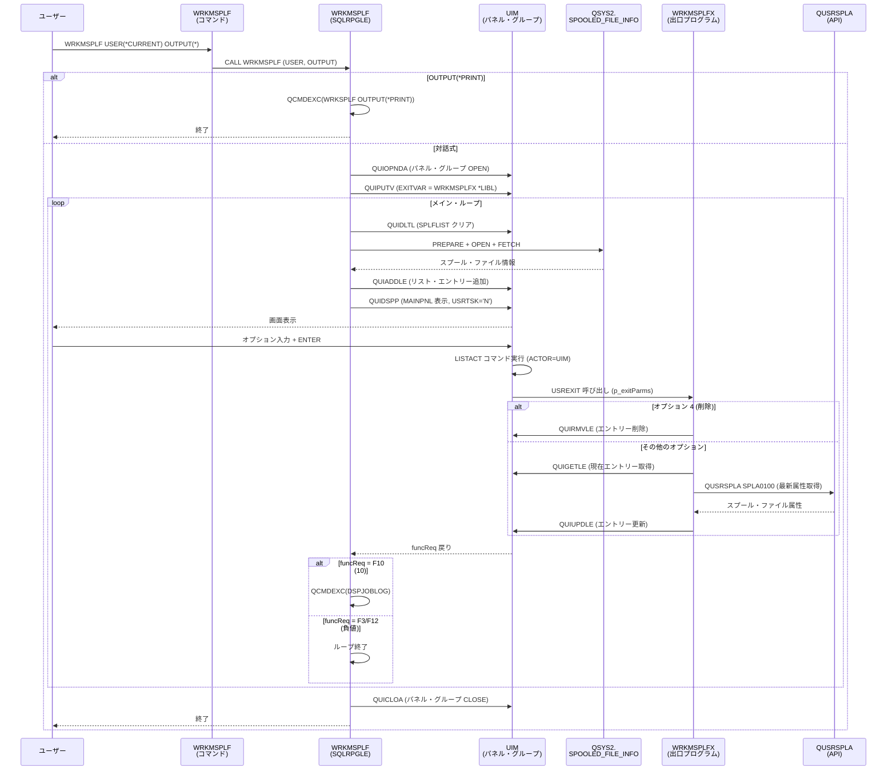

# WRKMSPLF プログラム仕様書

## 目次

1. [概要](#1-概要)
2. [コンポーネント一覧](#2-コンポーネント一覧)
3. [コマンド仕様 (WRKMSPLF.CMD)](#3-コマンド仕様-wrkmsplfcmd)
4. [メイン・プログラム仕様 (WRKMSPLF.SQLRPGLE)](#4-メインプログラム仕様-wrkmsplfuqlrpgle)
5. [UIM アクション・リスト出口プログラム仕様 (WRKMSPLFX.RPGLE)](#5-uim-アクションリスト出口プログラム仕様-wrkmsplfxrpgle)
6. [パネル・グループ仕様 (WRKMSPLF.PNLGRP)](#6-パネルグループ仕様-wrkmsplfpnlgrp)
7. [処理フロー](#7-処理フロー)
8. [データ構造](#8-データ構造)
9. [使用 API 一覧](#9-使用-api-一覧)
10. [画面説明](#10-画面説明)

---

## 1. 概要

| 項目 | 内容 |
|------|------|
| コマンド名 | `WRKMSPLF` |
| 機能名 | スプール・ファイルの処理 (Work with My Spooled Files) |
| ライブラリ | `MAIV300S` |
| 作成者 | Y.Ide |
| 作成日 | 2025/09/01 |
| バージョン | 6.1 (WRKMSPLF.SQLRPGLE) / 01.00 (WRKMSPLFX.RPGLE) |

### 機能説明

`WRKMSPLF` は IBM i の UIM (User Interface Manager) 技術を使用したスプール・ファイル管理コマンドです。  
指定されたユーザーのスプール・ファイル一覧を表示し、各スプール・ファイルに対して次の操作を対話式で実行できます。

- 属性変更、保留、削除、表示、解放
- ユーザー・メッセージ表示、属性参照、印刷状況確認
- PDF 変換、テキスト変換、コピー、メール送信

---

## 2. コンポーネント一覧

| コンポーネント | メンバー | ソース・ファイル | 説明 |
|--------------|---------|---------------|------|
| コマンド | `WRKMSPLF` | `QCMDSRC` | コマンド定義 |
| メイン・プログラム | `WRKMSPLF` | `QRPGLESRC` | UIM リスト制御 + SQL によるスプール情報取得 |
| 出口プログラム | `WRKMSPLFX` | `QRPGLESRC` | UIM アクション・リスト出口 (操作後のリスト更新) |
| パネル・グループ | `WRKMSPLF` | `QPNLSRC` | UIM 画面定義・ヘルプ情報 |

---

## 3. コマンド仕様 (WRKMSPLF.CMD)

### コマンド定義

```
CMD PROMPT('スプール・ファイルの処理')
    HLPID(WRKMSPLFC)
    HLPPNLGRP(MAI/WRKMSPLF)
```

### パラメーター

| パラメーター | キーワード | 型 | 長さ | デフォルト | 特別値 | 説明 |
|------------|---------|-----|-----|----------|--------|------|
| ユーザー | `USER` | `*NAME` | 10 | `*CURRENT` | `*CURRENT`, `*ALL` | 対象ユーザー |
| 出力 | `OUTPUT` | `*CHAR` | 6 | `*` | `*`, `*PRINT` | 出力先 |

#### USER パラメーター

| 値 | 説明 |
|----|------|
| `*CURRENT` | 現行ユーザーのスプール・ファイルを表示 |
| `*ALL` | すべてのユーザーのスプール・ファイルを表示 |
| ユーザー名 | 指定ユーザーのスプール・ファイルを表示 |

#### OUTPUT パラメーター

| 値 | 説明 |
|----|------|
| `*` | 対話式ジョブは画面表示、バッチ・ジョブは印刷 |
| `*PRINT` | スプール・ファイル一覧を印刷出力 |

---

## 4. メイン・プログラム仕様 (WRKMSPLF.SQLRPGLE)

### プログラム基本情報

| 項目 | 内容 |
|------|------|
| プログラム名 | `WRKMSPLF` |
| ソース・タイプ | SQLRPGLE (ILE RPG フリーフォーム + 埋め込み SQL) |
| アクティベーション・グループ | `*NEW` |
| バインド・ディレクトリー | `QC2LE` |
| バージョン | 6.1 |

### エントリー・パラメーター

| パラメーター | 変数名 | 型 | 長さ | 必須 | 説明 |
|------------|--------|-----|-----|------|------|
| ユーザー | `p_usr` | `char` | 10 | 任意 | 対象ユーザー (`options(*nopass)`) |
| 出力 | `p_output` | `char` | 6 | 任意 | 出力先 (`options(*nopass)`) |

### グローバル変数

| 変数名 | 型 | 初期値 | 説明 |
|--------|-----|--------|------|
| `applHandle` | `char(8)` | `''` | UIM アプリケーション・ハンドル |
| `funcReq` | `int(10)` | `0` | QUIDSPP 戻りファンクション要求 |
| `g_usr` | `char(10)` | `'*CURRENT'` | ユーザー・フィルター (ロード時に使用) |
| `g_sqlStmt` | `varchar(400)` | `''` | 動的 SQL ステートメント文字列 |
| `w_pnlName` | `char(10)` | `'MAINPNL'` | 表示パネル名 |
| `w_pgrpQnm` | `char(20)` | `'WRKMSPLF  *LIBL'` | パネル・グループ修飾名 |

### ファンクション・キー定数

| 定数名 | 値 | 説明 |
|--------|-----|------|
| `ENTKEY` | `0` | Enter キー (UIM が LISTACT を処理済み) |
| `F5KEY` | `5` | F5=最新表示 |
| `F10KEY` | `10` | F10=ジョブ・ログ表示 |

### 主処理フロー

```
1. エントリー・パラメーター処理
   - p_usr が渡された場合、g_usr に設定

2. OUTPUT(*PRINT) 処理
   - p_output = '*PRINT' の場合
     -> QCMDEXC で WRKSPLF SELECT(...) OUTPUT(*PRINT) を実行して終了

3. パネル・グループのオープン (QUIOPNDA)
   - エラー時はエスケープ・メッセージを送信して終了

4. 出口プログラム変数の設定 (QUIPUTV)
   - UIM 変数 EXITVAR に 'WRKMSPLFX *LIBL' をセット

5. メイン・ループ
   - clearList() でリストを削除
   - loadList() でスプール・ファイルをリストに追加
   - QUIDSPP でパネルを表示 (USRTSK='N')
   - funcReq に応じた処理:
     * ENTKEY (0): ループ継続 (UIM が LISTACT 処理済み)
     * F5KEY  (5): ループ継続 (リストを再ロード)
     * F10KEY (10): DSPJOBLOG を実行してループ継続
     * その他 (F3/F12): ループを抜ける

6. パネル・グループのクローズ (QUICLOA 'M')
```

### サブプロシージャー

#### clearList()

| 項目 | 内容 |
|------|------|
| 目的 | UIM リスト (`SPLFLIST`) を削除して再ロード前にクリア |
| 呼び出し API | `QUIDLTL` |
| エラー処理 | リストが未アクティブの場合のエラーは無視 |

**パラメーター:**

| 名称 | 型 | 方向 | 説明 |
|------|-----|------|------|
| `pApplHdl` | `char(8)` | 入力 | UIM アプリケーション・ハンドル |

---

#### loadList()

| 項目 | 内容 |
|------|------|
| 目的 | SQL で `QSYS2.SPOOLED_FILE_INFO` からスプール情報を取得し、UIM リストに追加 |
| SQL 方式 | 動的 SQL (PREPARE + OPEN + FETCH) |
| 呼び出し API | `QUIADDLE` |

**パラメーター:**

| 名称 | 型 | 方向 | 説明 |
|------|-----|------|------|
| `pApplHdl` | `char(8)` | 入力 | UIM アプリケーション・ハンドル |
| `pUsr` | `char(10)` | 入力 | ユーザー・フィルター |

**使用 SQL サービス:**

```sql
SELECT SPOOLED_FILE_NAME, JOB_NAME, JOB_USER,
       JOB_NUMBER, SPOOLED_FILE_NUMBER, TOTAL_PAGES,
       COPIES, STATUS, OUTPUT_QUEUE,
       COALESCE(USER_DATA, '')
  FROM TABLE(QSYS2.SPOOLED_FILE_INFO(USER_NAME => '<ユーザー名>')) x
 ORDER BY SPOOLED_FILE_NUMBER
```

**スプール状況コードの変換 (SQL STATUS -> UIM 表示コード):**

| SQL STATUS 値 | UIM 表示コード | 説明 |
|--------------|--------------|------|
| `OPEN` | `OPN` | オープン |
| `READY` | `RDY` | 作動可能 |
| `DEFERRED` | `DFR` | 据え置き |
| `SENDING` | `SND` | 送信中 |
| `CLOSED` | `CLO` | クローズ |
| `HELD` | `HLD` | 保留中 |
| `SAVED` | `SAV` | 保管 |
| `PENDING` | `PND` | 保留中 |
| `WRITING` | `WTR` | 書き出し中 |
| `PRINTING` | `PRT` | 印刷中 |
| `MESSAGE WAITING` | `MSGW` | メッセージ待機 |
| その他 | 先頭 4 文字 | そのまま表示 |

---

## 5. UIM アクション・リスト出口プログラム仕様 (WRKMSPLFX.RPGLE)

### プログラム基本情報

| 項目 | 内容 |
|------|------|
| プログラム名 | `WRKMSPLFX` |
| ソース・タイプ | RPGLE (ILE RPG フリーフォーム) |
| アクティベーション・グループ | `*CALLER` |
| バージョン | 01.00 |
| 作成日 | 2026/03/27 |

### 役割

UIM の `USREXIT='CALL EXITPGM'` 機構によって呼び出される出口プログラムです。  
ユーザーがリスト・オプションを実行した後、UIM リストのエントリーを更新または削除します。

### エントリー・パラメーター

| パラメーター | 変数名 | 型 | 長さ | 説明 |
|------------|--------|-----|-----|------|
| 出口パラメーター | `p_exitParms` | `char` | 70 | UIM アクション・リスト出口パラメーター構造 |

### 出口パラメーター構造 (exitParms DS)

UIM が渡す `Qui_ALX_t` / `EUIQALX` 構造体:

| フィールド名 | 型 | 位置 | 説明 |
|------------|-----|------|------|
| `strucLevel` | `int(10)` | 1 | 構造体レベル |
| `reserv1` | `char(8)` | 5 | 予約 |
| `callType` | `int(10)` | 13 | 呼び出し種別 (5 = アクション・リスト出口) |
| `applHandle` | `char(8)` | 17 | UIM アプリケーション・ハンドル |
| `panelName` | `char(10)` | 25 | パネル名 |
| `listName` | `char(10)` | 35 | リスト名 |
| `listEntry` | `char(4)` | 45 | リスト・エントリー・ハンドル |
| `listOption` | `int(10)` | 49 | 選択オプション番号 |
| `funcQualifier` | `int(10)` | 53 | ファンクション修飾子 (0=Enter, 1=Prompt) |
| `result` | `int(10)` | 57 | コマンド実行結果 (0=成功, 非ゼロ=エラー) |
| `fieldName` | `char(10)` | 61 | フィールド名 |

### 処理フロー

```
1. result <> 0 の場合 (コマンド失敗): 即時終了 (リスト変更なし)

2. オプション 4 (削除) の場合:
   - QUIRMVLE でリスト・エントリーを削除して終了

3. その他のオプション (2=変更, 3=保留, 6=解放 など):
   a. QUIGETLE で現在のリスト・エントリー内容を取得
   b. QUSRSPLA (SPLA0100) でスプール・ファイルの最新属性を取得
   c. スプール・ファイルが存在しない場合は QUIRMVLE でエントリーを削除して終了
   d. 最新属性を uimEntry バッファに反映:
      - 出口コード (uie_sts) をオプション番号に基づいて設定:
        * 2=変更 -> '*CHG'
        * 3=保留 -> '*HLD'
        * 6=解放 -> '*RLS'
        * その他  -> QUSRSPLA の status を変換
      - uie_outq, uie_usrdta, uie_pgs, uie_cpy を更新
   e. QUIUPDLE でリスト・エントリーを更新
```

### QUSRSPLA 使用情報

| 項目 | 値 |
|------|-----|
| API | `QUSRSPLA` (スプール・ファイル属性の検索) |
| フォーマット | `SPLA0100` |
| 修飾ジョブ名 | `uie_jobnm + uie_usr + uie_nbr` (26 文字) |

### SPLA0100 形式 主要フィールド

| フィールド名 | 型 | 説明 |
|------------|-----|------|
| `jobName` | `char(10)` | ジョブ名 |
| `userName` | `char(10)` | ユーザー名 |
| `jobNbr` | `char(6)` | ジョブ番号 |
| `splfName` | `char(10)` | スプール・ファイル名 |
| `splfNbr` | `int(10)` | スプール・ファイル番号 |
| `userData` | `char(10)` | ユーザー・データ |
| `status` | `char(10)` | スプール・ファイル状況 |
| `totPages` | `int(10)` | 総ページ数 |
| `totCopies` | `int(10)` | 総部数 |
| `outqName` | `char(10)` | 出力待ち行列名 |

---

## 6. パネル・グループ仕様 (WRKMSPLF.PNLGRP)

### パネル・グループ基本情報

| 項目 | 内容 |
|------|------|
| パネル・グループ名 | `WRKMSPLF` |
| リスト動作 | `ACTOR=UIM` (UIM がアクション・リストを自動処理) |
| ヘルプ | コマンド・プロンプト・ヘルプ `HLPID=WRKMSPLFC` 含む |

### クラス定義

| クラス名 | 基本型 | 説明 |
|--------|--------|------|
| `ACTNCLS` | `ACTION` | オプション入力フィールド |
| `CHAR10` | `CHAR 10` | 文字 10 桁 |
| `CHAR6` | `CHAR 6` | 文字 6 桁 |
| `STSCLS` | `CHAR 10` | 状況コード |
| `PGSCLS` | `BIN 15` (幅 5) | ページ数・部数 |
| `PARMCLS` | `CHAR 255` | コマンド行・パラメーター文字列 |
| `PGMCLS` | `CHAR 20` | プログラム修飾名 |

### ダイアログ変数定義 (VARRCD)

#### SPLFENT (リスト・エントリー、78 バイト)

| 変数名 | クラス | バイト数 | 説明 |
|--------|--------|---------|------|
| `OPT` | `ACTNCLS` (BIN 15) | 2 | オプション番号 |
| `FIL` | `CHAR10` | 10 | スプール・ファイル名 |
| `USR` | `CHAR10` | 10 | ユーザー名 |
| `OUTQ` | `CHAR10` | 10 | 出力待ち行列名 |
| `USRDTA` | `CHAR10` | 10 | ユーザー・データ |
| `STS` | `STSCLS` | 10 | 状況コード |
| `PGS` | `PGSCLS` (BIN 15) | 2 | 総ページ数 |
| `CPY` | `PGSCLS` (BIN 15) | 2 | 部数 |
| `NBR` | `CHAR6` | 6 | ジョブ番号 |
| `JOBNM` | `CHAR10` | 10 | ジョブ名 |
| `SPN` | `CHAR6` | 6 | スプール・ファイル番号 |
| **合計** | | **78** | |

#### PARMENT

| 変数名 | クラス | 説明 |
|--------|--------|------|
| `ZCMD` | `PARMCLS` | コマンド行入力 |

#### EXITVAR

| 変数名 | クラス | 説明 |
|--------|--------|------|
| `EXITPGM` | `PGMCLS` | 出口プログラム修飾名 |

### リスト・アクション定義 (ACTOR=UIM)

| オプション | 表示テキスト | 実行コマンド | F4 プロンプト対応 |
|-----------|------------|------------|----------------|
| 2 | 変更 | `CHGSPLFA` | あり |
| 3 | 保留 | `HLDSPLF` | あり |
| 4 | 削除 | `DLTSPLF` | あり |
| 5 | 表示 | `DSPSPLF` | あり |
| 6 | 解放 | `RLSSPLF` | あり |
| 7 | メッセージ | `WRKMSG MSGQ(&USR.)` | あり |
| 8 | 属性 | `WRKSPLFA` | あり |
| 9 | 印刷状況 | `WRKOUTQ OUTQ(&OUTQ.)` | あり |
| 11 | PDF | `MAI/SPLTOPDF` | あり |
| 12 | テキスト | `MAI/SPLTOTXT` | あり |
| 13 | コピー | `CPYSPLF` | あり |
| 14 | メール | `MAI/SPLTOMAIL` | あり |

> **注意:** 各アクションには `USREXIT='CALL EXITPGM'` が設定されており、コマンド実行後に `WRKMSPLFX` が呼び出されます。

### ファンクション・キー定義

| キー | アクション | 説明 |
|------|-----------|------|
| F1 / HELP | `HELP` | ヘルプ表示 |
| ENTER | `ENTER` | リスト・アクション実行 |
| F3 | `EXIT` | プログラム終了 |
| F4 | `PROMPT` | コマンド・プロンプト表示 |
| F5 | `RETURN 5` | 最新表示 (funcReq=5) |
| F9 | `RETRIEVE` | コマンド再生 |
| F10 | `RETURN 10` | ジョブ・ログ表示 (funcReq=10) |
| F12 | `CANCEL` | 取消し |
| F24 | `MOREKEYS` | キーの続きを表示 |
| PAGE DOWN | `PAGEDOWN` | 次ページ |
| PAGE UP | `PAGEUP` | 前ページ |

### リスト列定義

| 列変数 | 使用 | 最大幅 | ヘッダー |
|--------|------|--------|---------|
| `OPT` | INOUT | 3 | OPT |
| `FIL` | OUT | 10 | ファイル |
| `USR` | OUT | 10 | ユーザー |
| `OUTQ` | OUT | 10 | 装置/待ち行列 |
| `USRDTA` | OUT | 10 | ユーザー・データ |
| `STS` | OUT | 4 | STS |
| `PGS` | OUT | 6 | 合計数 |
| `CPY` | OUT | 6 | 部数 |

---

## 7. 処理フロー

### 全体シーケンス



### OUTPUT(*PRINT) 処理

`OUTPUT(*PRINT)` が指定された場合、WRKMSPLF は自分でリストを印刷するのではなく、IBM i 標準コマンド `WRKSPLF` に委譲します。

```
WRKSPLF SELECT(<ユーザー名>) OUTPUT(*PRINT)
```

---

## 8. データ構造

### UIM リスト・エントリー (uimEntry DS / VARRCD SPLFENT)

```
+--------+----------+----------+----------+----------+----------+------+------+--------+----------+--------+
| OPT    | FIL      | USR      | OUTQ     | USRDTA   | STS      | PGS  | CPY  | NBR    | JOBNM    | SPN    |
| BIN 15 | CHAR 10  | CHAR 10  | CHAR 10  | CHAR 10  | CHAR 10  | BIN15| BIN15| CHAR 6 | CHAR 10  | CHAR 6 |
| 2 byte | 10 bytes | 10 bytes | 10 bytes | 10 bytes | 10 bytes | 2 b  | 2 b  | 6 bytes| 10 bytes | 6 bytes|
+--------+----------+----------+----------+----------+----------+------+------+--------+----------+--------+
                                                                          Total: 78 bytes
```

### 出口パラメーター構造 (exitParms DS / Qui_ALX_t)

```
Offset  Len  Field
   1     4   strucLevel   (INT 10)
   5     8   reserv1      (CHAR 8)
  13     4   callType     (INT 10)  -- 5 = Action List Exit
  17     8   applHandle   (CHAR 8)
  25    10   panelName    (CHAR 10)
  35    10   listName     (CHAR 10)
  45     4   listEntry    (CHAR 4)
  49     4   listOption   (INT 10)
  53     4   funcQualifier(INT 10)  -- 0=Enter, 1=Prompt
  57     4   result       (INT 10)  -- 0=Success
  61    10   fieldName    (CHAR 10)
             Total: 70 bytes
```

---

## 9. 使用 API 一覧

### UIM API

| API | プログラム | 説明 |
|-----|-----------|------|
| `QUIOPNDA` | WRKMSPLF | UIM アプリケーションのオープン |
| `QUIDSPP` | WRKMSPLF | パネルの表示 (USRTSK='N' で F3 プロンプト折り返し防止) |
| `QUICLOA` | WRKMSPLF | UIM アプリケーションのクローズ |
| `QUIADDLE` | WRKMSPLF | リスト・エントリーの追加 |
| `QUIDLTL` | WRKMSPLF | リストの削除 |
| `QUIPUTV` | WRKMSPLF | ダイアログ変数への書き込み |
| `QUIGETV` | WRKMSPLF | ダイアログ変数の読み取り |
| `QUIGETLE` | WRKMSPLFX | リスト・エントリーの取得 |
| `QUIUPDLE` | WRKMSPLFX | リスト・エントリーの更新 |
| `QUIRMVLE` | WRKMSPLFX | リスト・エントリーの削除 |

### システム API / コマンド

| API / コマンド | プログラム | 説明 |
|--------------|-----------|------|
| `QCMDEXC` | WRKMSPLF | CL コマンドの実行 |
| `QMHSNDPM` | WRKMSPLF | プログラム・メッセージの送信 |
| `QUSRSPLA` | WRKMSPLFX | スプール・ファイル属性の取得 (SPLA0100) |

### SQL サービス

| SQL サービス | プログラム | 説明 |
|-------------|-----------|------|
| `QSYS2.SPOOLED_FILE_INFO` | WRKMSPLF | スプール・ファイル情報の取得 |

---

## 10. 画面説明

### メイン画面 (MAINPNL)

```
                         スプール・ファイルの処理                   SYSTEM
                                                                   xx/xx/xx xx:xx:xx
 オプションを入力して、実行キーを押してください。
  2=変更  3=保留  4=削除  5=表示  6=解放  7=メッセージ  8=属性
  9=印刷状況  11=PDF  12=テキスト  13=コピー  14=メール

 OPT  ファイル   ユーザー   装置/待ち行列  ユーザー・データ  STS  合計数  部数
      QPJOBLOG   QSYSOPR    PRT01          QPJOBLOG          RDY      2      1
      QPDSPJOB   IDE        PRT01                            HLD     10      1
 ===>
 F3=終了  F4=プロンプト  F5=最新表示  F9=コマンドの再生
 F10=ジョブ・ログ表示  F12=取消し  F24=キーの続き
```

### 主要な表示列

| 列 | 説明 |
|----|------|
| OPT | オプション入力欄 (入出力) |
| ファイル | スプール・ファイル名 |
| ユーザー | スプール・ファイル所有者 |
| 装置/待ち行列 | 出力待ち行列名 |
| ユーザー・データ | ユーザー定義テキスト |
| STS | スプール状況コード |
| 合計数 | 総ページ数 |
| 部数 | 印刷部数 |

### スプール状況コード

| コード | 意味 |
|--------|------|
| `RDY` | 作動可能 - 印刷可能な状態 |
| `OPN` | オープン - 書き込み中 |
| `DFR` | 据え置き - 印刷据え置き |
| `SND` | 送信中 - リモートへ送信中/送信済み |
| `CLO` | クローズ - 処理完了、ジョブ終了まで保留 |
| `HLD` | 保留中 - ユーザーまたはシステムによる保留 |
| `SAV` | 保管 - 印刷後保管 |
| `PND` | 保留中 - 印刷変換中または印刷待ち |
| `WTR` | 書き出し中 - 出力作成中 |
| `PRT` | 印刷中 - 印刷完了待ち |
| `MSGW` | メッセージ待機 - 応答が必要 |
| `*CHG` | 変更済み - オプション 2 実行後 |
| `*HLD` | 保留済み - オプション 3 実行後 |
| `*RLS` | 解放済み - オプション 6 実行後 |

---

*仕様書生成日: 2025年*  
*ライブラリ: MAIV300S*
